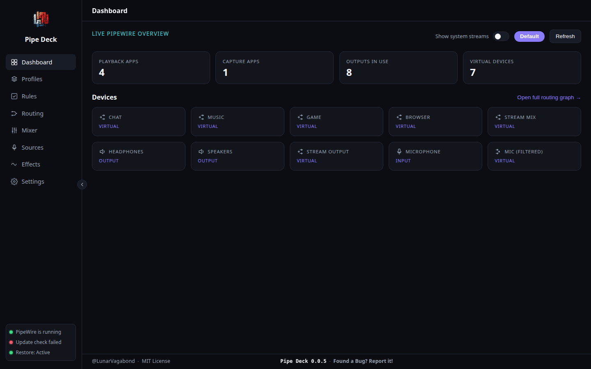
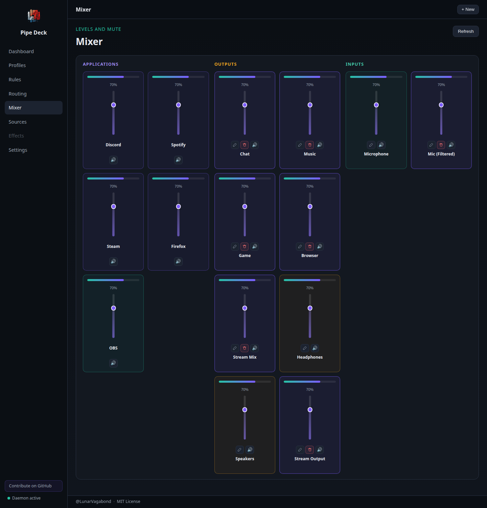
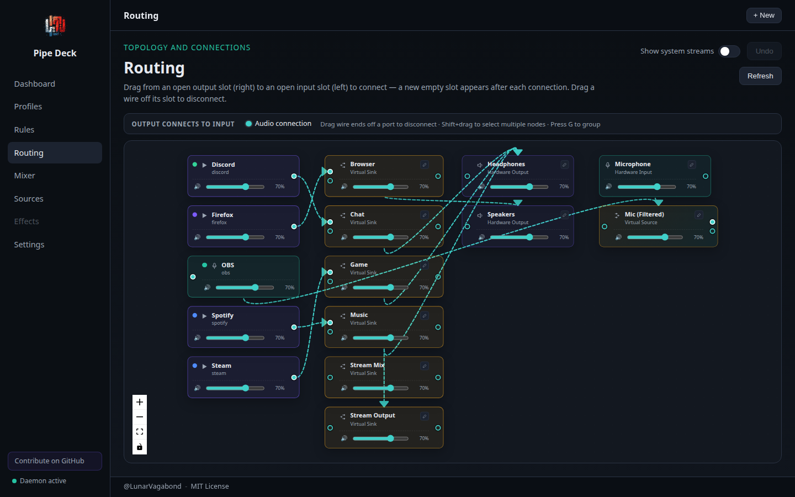
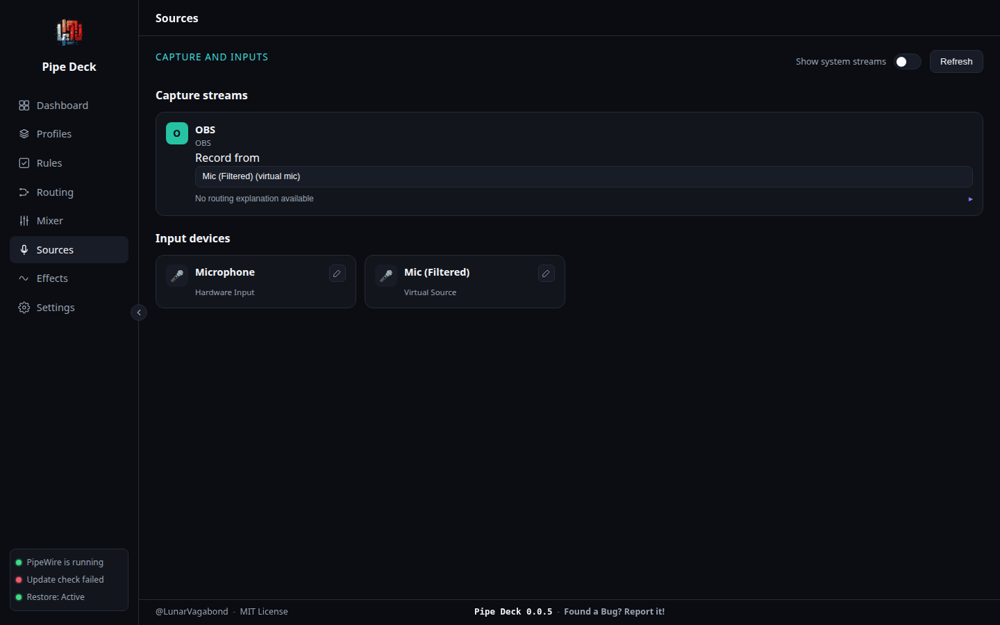

# Pipe Deck

Linux audio is incredibly powerful — but managing it often means juggling `pavucontrol`, `qpwgraph`, Helvum, WirePlumber config, `pw-cli`, and a pile of custom scripts just to route one app to the right output. Pipe Deck brings those everyday workflows together into a single, modern control center built for PipeWire.

It's not another volume mixer. It's a workflow-focused desktop app for routing, mixing, profiles, virtual devices, and rule-based automation — the day-to-day PipeWire tasks that today mean switching between several separate tools.

[](https://github.com/LunarVagabond/Pipe-Deck/actions/workflows/build.yml)

## Why Pipe Deck exists

PipeWire itself is genuinely capable — it's the plumbing, not the problem. The gap is on top of it: routing an app, saving a known-good setup, spinning up a virtual sink, or automating "when Discord opens, send it to my headset" each pull in a different tool, and none of them share state with each other.

| Task | Typical tools today | With Pipe Deck |
|------|---------------------|-----------------|
| Per-app output routing | `pavucontrol`, `qpwgraph` | Routing matrix + live dashboard |
| Volume and mute | `pavucontrol`, desktop applets | Unified mixer panel |
| Saved setups | Manual scripts, dotfiles | YAML profiles — save, swap, export |
| Virtual sinks/sources | `pw-cli`, `module-null-sink` | Guided virtual device workflows |
| Automation | Custom shell hooks | Rule engine with simulation |

None of those existing tools are going away, and Pipe Deck doesn't try to replace them — WirePlumber still manages the session, PipeWire still owns the graph. Pipe Deck is the layer that makes routing, mixing, virtual devices, and automation feel like one app instead of five.

Curious about the backstory? Read about [why this project exists](docs/product/About.md).

## What Pipe Deck is — and isn't

Pipe Deck is:

- An audio **control center** — one place for the PipeWire tasks you'd otherwise reach for several tools to do
- A **workflow layer** on top of PipeWire, not a replacement for it
- **PipeWire-first** and Linux-native, designed so changes are visible, reversible, and safe

Pipe Deck is **not**:

- A DAW or audio editor
- An effects processor or plugin host like Carla
- A replacement for PipeWire, WirePlumber, or the tools above — it sits on top of them

## Project philosophy

Pipe Deck's guiding question for every change — feature, bug fix, docs update, or architecture decision — is:

> Does this help users better understand and manage their audio, or help the community build and maintain the tools that make that possible?

That's a deliberately two-sided bar. The first half keeps the app itself honest: not "is this technically possible with PipeWire," but "does this make someone's actual setup clearer or easier to control." The second half is newer and just as real — documentation, test coverage, contributor tooling, and process fixes count too, because a project only stays useful if the people building it can keep building it. See the [full reasoning](docs/product/About.md) behind the mission.

## What you can do with it

**Device management** — See every device and stream normalized into one live graph instead of piecing state together across tools.

**Audio routing** — Reroute an app between speakers, a headset, or a virtual sink without opening a separate graph editor.

**Profiles & automation** — Save a known-good setup as a YAML profile and restore it after a reboot; author priority-based rules ("Discord → headset") and simulate them before they touch anything live.

**Virtual devices** — Create virtual sinks and sources through a guided workflow instead of hand-rolling `pw-cli`/`module-null-sink` invocations.

**Monitoring** — A live dashboard shows the current routing graph so you can see what's connected to what before you change it.

**Plugin system** — Extend behavior through isolated JSON-RPC plugins without touching core routing logic. See the [Plugin API](docs/specs/Plugin_API.md).

**Developer features** — A mock PipeWire backend for UI iteration without a live audio stack, a typed Rust↔TypeScript graph model, and `make`-driven build/test/release targets.

## Screenshots

| Dashboard | Mixer |
|-----------|-------|
|  |  |

| Routing | Sources |
|---------|---------|
|  |  |

## Architecture overview

Pipe Deck doesn't link against PipeWire natively — the integration layer shells out to `pactl`, `pw-link`, and `pw-dump` and parses their output, behind a platform-neutral backend trait so the engine code never depends on that detail directly. A normalized `RuntimeGraph` (devices, streams, links) is the single source of truth pushed to the UI for the dashboard, mixer, and routing views alike.

Full breakdown: [System Architecture](docs/architecture/System_Architecture.md) and [PipeWire Design](docs/architecture/PipeWire_Design.md).

## Plugin system

Plugins run as separate processes speaking JSON-RPC over stdio, with capabilities (reading profile state, suggesting routes, managing effects) granted explicitly rather than assumed. That isolation means a misbehaving or crashing plugin can't take the core app down with it.

Building one? Start with [Plugins](docs/developers/Plugins.md) and the [Plugin API](docs/specs/Plugin_API.md).

## Installation

### For users

You don't need Rust, Node, or a build toolchain to run Pipe Deck — grab a prebuilt binary from the [latest release](https://github.com/LunarVagabond/Pipe-Deck/releases/latest):

- **AppImage** — download, mark executable, run. Works on almost any distro, no install step.
- **.deb** — Debian, Ubuntu, Pop!_OS, Mint.
- **.rpm** — Fedora and other RPM-based distros.

You'll still need **PipeWire** (and the PulseAudio compatibility layer where applicable) already running, since Pipe Deck talks to it through `pactl`, `pw-link`, and `pw-dump` — standard on any modern PipeWire desktop.

Full walkthrough, including first launch and your first route: [Getting Started for Users](docs/product/Getting_Started_Users.md).

### For developers

Building from source, contributing, or writing a plugin? You'll need:

- Linux with **PipeWire** (and PulseAudio compatibility layer where needed) — `pactl`, `pw-link`, and `pw-dump` must be on your `PATH`
- **Rust** (stable) — via [rustup](https://rustup.rs/)
- **Node.js 20+** and npm
- Tauri's Linux system dependencies. On Debian/Ubuntu (also what CI installs):

  ```bash
  sudo apt-get install -y \
    libwebkit2gtk-4.1-dev \
    build-essential \
    libayatana-appindicator3-dev \
    librsvg2-dev \
    patchelf
  ```

  Other distros: see [Tauri's prerequisites guide](https://tauri.app/start/prerequisites/) for the equivalent packages.

```bash
git clone https://github.com/LunarVagabond/Pipe-Deck.git
cd Pipe-Deck
make install   # first-time setup
make start     # run desktop app in dev mode
```

No PipeWire environment handy? `PIPE_DECK_USE_MOCK=1 make start` runs against a static sample graph instead of live PipeWire — useful for UI work in a VM or container.

```bash
make check     # frontend type-check + cargo check
make test      # Rust unit tests
make build     # production bundles
make help      # list all commands
```

Full walkthrough, prerequisites table, and troubleshooting: [Getting Started (developers)](docs/developers/Getting_Started.md).

## Roadmap

Pipe Deck is under active development toward a v0.5.0 beta. See the [Roadmap](docs/product/Roadmap.md) for what's planned and the [Decisions](docs/architecture/Decisions.md) log for the architectural choices behind it.

## Documentation

Product and technical docs live in [`docs/`](docs/README.md):

| Section | Contents |
|---------|----------|
| [Docs index](docs/README.md) | User-facing overview and doc map |
| [Getting Started](docs/developers/Getting_Started.md) | Prerequisites, first run, and [Development](docs/developers/Development.md) codebase layout |
| [Product](docs/product/Product_Requirements.md) | Requirements, roadmap, decisions |
| [Architecture](docs/architecture/System_Architecture.md) | System and PipeWire design |
| [Specifications](docs/specs/UI_Spec.md) | UI, config, plugins, rule engine |
| [Developers](docs/developers/Development.md) | Packaging, plugins, [Releasing](docs/developers/Release.md) |

Open work is tracked in [GitHub Issues](https://github.com/LunarVagabond/Pipe-Deck/issues). List locally with `gh issue list`.

## Related projects

Pipe Deck complements — not replaces — the PipeWire stack. You may also use:

- [PipeWire](https://pipewire.org/) — session and audio graph
- [WirePlumber](https://gitlab.freedesktop.org/pipewire/wireplumber) — session manager
- [qpwgraph](https://gitlab.freedesktop.org/rncbc/qpwgraph) — node graph editor
- [pavucontrol](https://freedesktop.org/software/pulseaudio/pavucontrol/) — classic PulseAudio/PipeWire volume UI

## Contributing

Pipe Deck is community-driven, and that's not limited to code. Contributors so far have included bug reports, documentation fixes, UI polish, plugin ideas, and testing on hardware the maintainer doesn't own — all of it moves the project forward, not just pull requests.

Every proposal is checked against the [project philosophy](#project-philosophy) above. If it passes, see [Contributing](.github/CONTRIBUTING.md) for the branch/PR workflow, or open an issue to propose the idea first. [Plugin authors](docs/developers/Plugins.md) should also read the [Plugin API](docs/specs/Plugin_API.md).

- [GitHub Discussions](https://github.com/LunarVagabond/Pipe-Deck/discussions) — design questions, proposals, and anything worth keeping searchable
- [Discord](https://discord.gg/cHtuCFkRRm) — "Dev Syndicate" server, casual chat and quick questions

If a process rule in [Contributing](.github/CONTRIBUTING.md) gets in the way, raising it in a Discussion or on Discord is welcome — see [If A Convention Gets In The Way](.github/CONTRIBUTING.md#if-a-convention-gets-in-the-way).

## FAQ

**Does this replace PipeWire or WirePlumber?** No. Pipe Deck shells out to standard PipeWire tooling (`pactl`, `pw-link`, `pw-dump`) and sits on top of the session PipeWire/WirePlumber already manage — it doesn't compete with them.

**Is it stable enough for daily use?** Pipe Deck is pre-1.0 and under active development — see the [Roadmap](docs/product/Roadmap.md) for what's landed and what's still ahead. Profiles and routing changes are designed to be visible and reversible, but treat it as active alpha/beta software, not a finished product.

**Do I need to know PipeWire internals to use it?** No — that's the point. Familiarity with `pavucontrol`/`qpwgraph`-style tools helps you map concepts across, but Pipe Deck's dashboard and routing matrix are meant to stand on their own.

**Can I extend it?** Yes, via the [plugin system](#plugin-system) — plugins run isolated and request only the capabilities they need.

## Support the project

Pipe Deck stays useful because people use it, report what's broken, and help fix it — that's worth as much as the financial side. If you'd like to support continued development directly (time, testing hardware, project sustainability), buying a coffee is appreciated but entirely optional:

<a href="https://www.buymeacoffee.com/lunarvagabond" target="_blank"></a>

Code, docs, bug reports, UI ideas, plugin contributions, and testing feedback all help just as much. Linux audio tooling gets built by the people who use it — if Pipe Deck has saved you a headache, there's a good chance improving it will save someone else one too.

## License

[MIT](LICENSE)
