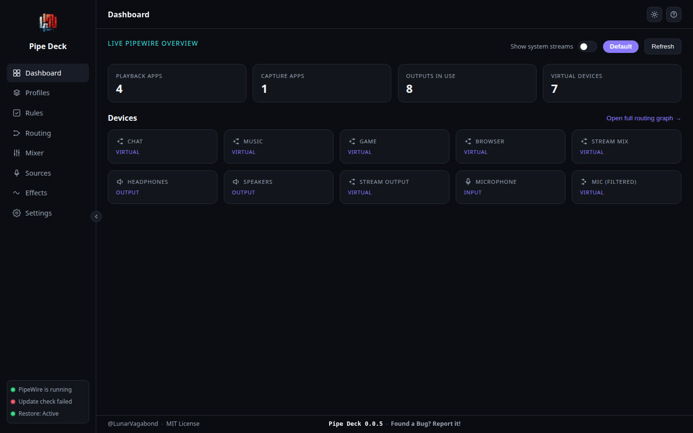
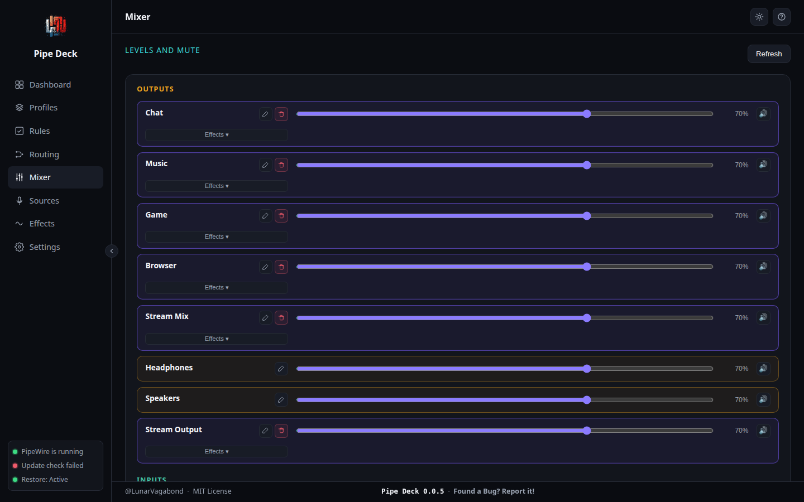
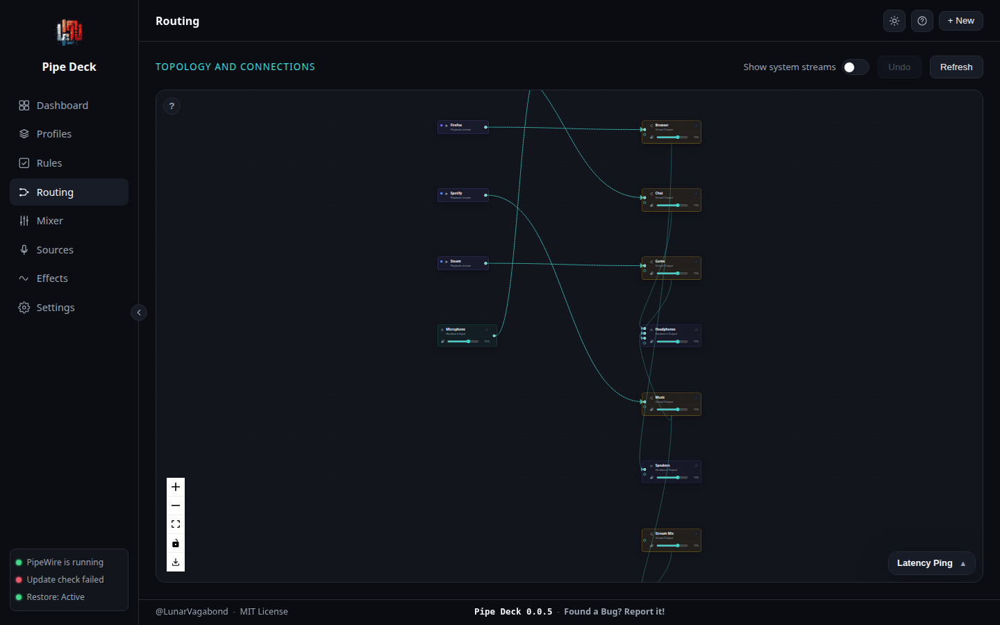
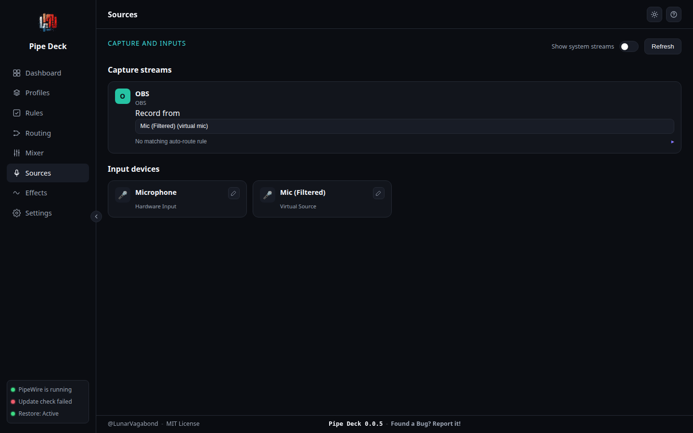

# Pipe Deck

[](https://github.com/LunarVagabond/Pipe-Deck/actions/workflows/build.yml)

Linux audio is powerful, but managing it today means juggling `pavucontrol`, `qpwgraph`, Helvum, WirePlumber config, `pw-cli`, and a pile of scripts — just to route one app to the right output. Pipe Deck brings those everyday PipeWire tasks into one modern control center: routing, mixing, profiles, virtual devices, and rule-based automation, in a single workflow-focused desktop app instead of five separate tools.

## Why Pipe Deck

PipeWire itself is genuinely capable — it's the plumbing, not the problem. The gap is on top of it: routing an app, saving a known-good setup, spinning up a virtual sink, or automating "when Discord opens, send it to my headset" each pull in a different tool, and none of them share state.

| Task                   | Typical tools today            | With Pipe Deck                     |
| ---------------------- | ------------------------------ | ---------------------------------- |
| Per-app output routing | `pavucontrol`, `qpwgraph`      | Routing matrix + live dashboard    |
| Volume and mute        | `pavucontrol`, desktop applets | Unified mixer panel                |
| Saved setups           | Manual scripts, dotfiles       | YAML profiles — save, swap, export |
| Virtual sinks/sources  | `pw-cli`, `module-null-sink`   | Guided virtual device workflows    |
| Automation             | Custom shell hooks             | Rule engine with simulation        |

Nothing here goes away — WirePlumber still manages the session, PipeWire still owns the graph. Pipe Deck is the layer that makes routing, mixing, virtual devices, and automation feel like one app instead of five. Curious about the backstory? Read [why this project exists](docs/product/About.md).

**Pipe Deck is** an audio control center and workflow layer on top of PipeWire — PipeWire-first, Linux-native, built so changes are visible and reversible.

**Pipe Deck is not** a DAW, an effects processor/plugin host like Carla, or a replacement for PipeWire, WirePlumber, or the tools above — it sits on top of them.

## Screenshots

| Dashboard                                                  | Mixer                                                     |
| ---------------------------------------------------------- | --------------------------------------------------------- |
|  |  |

| Routing                                                     | Sources                                                          |
| ----------------------------------------------------------- | ---------------------------------------------------------------- |
|  |  |

## Get started

**Users** — grab a prebuilt binary from the [latest release](https://github.com/LunarVagabond/Pipe-Deck/releases/latest): AppImage (any distro, no install step), `.deb` (Debian/Ubuntu/Pop!_OS/Mint), or `.rpm` (Fedora and friends). You'll need PipeWire already running (standard on any modern PipeWire desktop) — Pipe Deck talks to it through `pactl`, `pw-link`, and `pw-dump`.

Once it's open: the dashboard shows your live routing graph, and dragging a connection between an app and an output _is_ routing — no separate graph editor. Full walkthrough: [Getting Started for Users](docs/product/Getting_Started_Users.md).

**Developers** — you'll need Rust (via [rustup](https://rustup.rs/)), Node.js 20+, PipeWire dev tooling, and Tauri's Linux dependencies ([prerequisites guide](https://tauri.app/start/prerequisites/)):

```bash
git clone https://github.com/LunarVagabond/Pipe-Deck.git
cd Pipe-Deck
make install   # first-time setup
make start     # run desktop app in dev mode
```

No PipeWire environment handy? `PIPE_DECK_USE_MOCK=1 make start` runs against a static sample graph. `make help` lists every other target (`check`, `test`, `build`, ...). Full walkthrough and troubleshooting: [Getting Started for Developers](docs/developers/Getting_Started.md).

## What can I build with it?

- Route Discord to your headset while game audio stays on the speakers — without opening two apps' volume mixers separately.
- Save a full streaming setup (mic → filter chain → virtual sink → OBS) as a profile, and restore it in one click after a reboot.
- Auto-switch output to your headset when a video call opens, and back to speakers when it ends — as a rule you simulate before it touches anything live.
- Spin up a virtual sink for recording software's input through a guided workflow, instead of hand-rolling `pw-cli`/`module-null-sink` invocations.
- Watch the live routing graph before you touch anything, instead of guessing what's connected to what.

## Learn more

Full docs live in [`docs/`](docs/README.md), split by audience:

| User docs                                                                                         | Developer docs                                                                                                            |
| ------------------------------------------------------------------------------------------------- | ------------------------------------------------------------------------------------------------------------------------- |
| [Getting Started](docs/product/Getting_Started_Users.md)                                          | [Getting Started (dev)](docs/developers/Getting_Started.md) + [Development](docs/developers/Development.md)               |
| [Product Requirements](docs/product/Product_Requirements.md) & [Roadmap](docs/product/Roadmap.md) | [System Architecture](docs/architecture/System_Architecture.md) & [PipeWire Design](docs/architecture/PipeWire_Design.md) |
| [About / project story](docs/product/About.md)                                                    | [Specifications](docs/specs/UI_Spec.md) — UI, config, plugins, rule engine                                                |
| —                                                                                                 | [Plugins](docs/developers/Plugins.md) & [Plugin API](docs/specs/Plugin_API.md), [Releasing](docs/developers/Release.md)   |

A few things worth knowing up front, in brief:

- **Architecture** — Pipe Deck doesn't link against PipeWire natively; it shells out to `pactl`, `pw-link`, and `pw-dump` behind a platform-neutral backend trait, and pushes a normalized `RuntimeGraph` to the UI as the single source of truth. Details: [System Architecture](docs/architecture/System_Architecture.md).
- **Plugins** — run as isolated processes speaking JSON-RPC over stdio, with capabilities granted explicitly rather than assumed, so a misbehaving plugin can't take the core app down. Start with [Plugins](docs/developers/Plugins.md).
- **Philosophy** — every change is checked against one question: does this help users understand and manage their audio, or help the community build and maintain the tools that make that possible? Full reasoning: [About](docs/product/About.md).

Pipe Deck is pre-1.0 and under active development. [Roadmap](docs/product/Roadmap.md) covers direction; [milestones](https://github.com/LunarVagabond/Pipe-Deck/milestones) and [epics](https://github.com/LunarVagabond/Pipe-Deck/issues?q=is%3Aissue+label%3Aepic) track what's shipping when. Open work: [GitHub Issues](https://github.com/LunarVagabond/Pipe-Deck/issues) (`gh issue list` locally).

## Contributing

Pipe Deck is community-driven, and that's not limited to code — bug reports, documentation fixes, UI polish, plugin ideas, and testing on hardware the maintainer doesn't own all move the project forward.

Every proposal is checked against the [philosophy](#learn-more) above. If it passes, see [Contributing](.github/CONTRIBUTING.md) for the branch/PR workflow, or open an issue to propose the idea first. Plugin authors should also read the [Plugin API](docs/specs/Plugin_API.md).

- [GitHub Discussions](https://github.com/LunarVagabond/Pipe-Deck/discussions) — design questions, proposals, anything worth keeping searchable
- [Discord](https://discord.gg/cHtuCFkRRm) — "Dev Syndicate" server, casual chat and quick questions

If a process rule in [Contributing](.github/CONTRIBUTING.md) gets in the way, raising it is welcome — see [If A Convention Gets In The Way](.github/CONTRIBUTING.md#if-a-convention-gets-in-the-way).

## FAQ

**Does this replace PipeWire or WirePlumber?** No. Pipe Deck shells out to standard PipeWire tooling and sits on top of the session PipeWire/WirePlumber already manage.

**Is it stable enough for daily use?** Pipe Deck is pre-1.0 — see [open milestones](https://github.com/LunarVagabond/Pipe-Deck/milestones) for the current target. Changes are designed to be visible and reversible, but treat it as active alpha/beta software.

**Do I need to know PipeWire internals?** No — that's the point. Familiarity with `pavucontrol`/`qpwgraph` helps you map concepts across, but the dashboard and routing matrix are meant to stand on their own.

**Can I extend it?** Yes, via the [plugin system](#learn-more) — plugins run isolated and request only the capabilities they need.

## Related projects

Pipe Deck complements — not replaces — the PipeWire stack:

- [PipeWire](https://pipewire.org/) — session and audio graph
- [WirePlumber](https://gitlab.freedesktop.org/pipewire/wireplumber) — session manager
- [qpwgraph](https://gitlab.freedesktop.org/rncbc/qpwgraph) — node graph editor
- [pavucontrol](https://freedesktop.org/software/pulseaudio/pavucontrol/) — classic PulseAudio/PipeWire volume UI

## Support the project

Pipe Deck stays useful because people use it, report what's broken, and help fix it — that's worth as much as the financial side. If you'd like to support development directly, buying a coffee is appreciated but entirely optional:

<a href="https://www.buymeacoffee.com/lunarvagabond" target="_blank"></a>

Code, docs, bug reports, UI ideas, plugin contributions, and testing feedback all help just as much. Linux audio tooling gets built by the people who use it — if Pipe Deck has saved you a headache, there's a good chance improving it will save someone else one too.

## License

[](LICENSE)
