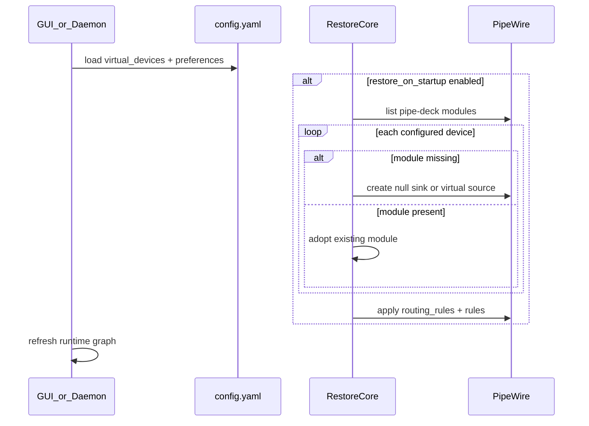
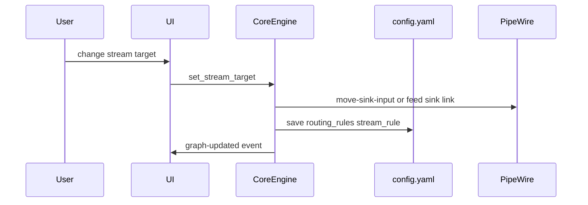
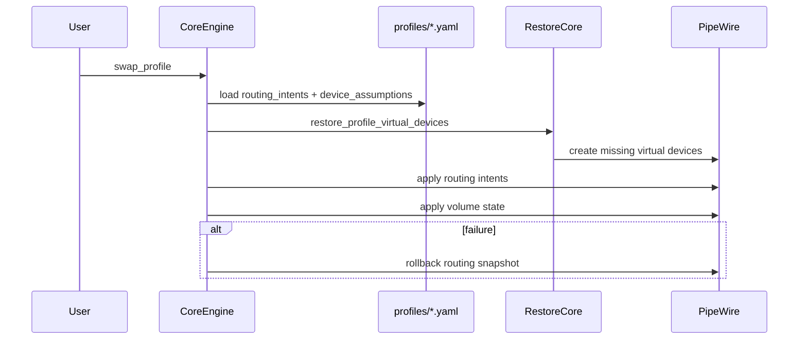

# System Architecture

## Purpose

Define the major system components, ownership boundaries, and data/control flow for Pipe Deck.

## In Scope

- UI, core engine, PipeWire integration, optional daemon, and extension surfaces.
- Flow of user actions into safe audio routing operations.
- Boundaries that protect maintainability and testability.

## Out of Scope

- Low-level PipeWire protocol implementation details.
- Final runtime packaging/deployment mechanics.
- Concrete API signatures (covered in dedicated specs).

## Guiding Principle

The UI must not manipulate PipeWire directly.

All state-changing operations flow through the core engine, and later through an optional daemon where persistence/background behavior is needed.

## High-Level Components

- UI Application (Tauri shell + Vue TypeScript interaction layer)
- Core Engine (domain logic and orchestration)
- Config Store (file-based YAML profiles and main config)
- PipeWire Integration Layer (safe adapter around PipeWire concepts)
- Optional Daemon (Phase 4 background restore)
- Optional CLI/API surfaces (future automation)

## Responsibilities

### UI Application

- Device and stream discovery presentation.
- Routing graph and mixer interactions.
- Profile and rule editing UX.
- Explanations for current routing decisions.

### Core Engine

- Routing intent model and command handling.
- Profile load, save, swap, validation, and apply/rollback.
- Rule evaluation orchestration (Phase 3+).
- Event bus for UI updates and diagnostics.

### Config Store

- File-based YAML persistence owned by core engine.
- Main config (`config.yaml`): preferences, active profile pointer, profile index.
- Profile files (`profiles/*.yaml`): desired routing state snapshots.
- Export/import via file copy or simple archive; no database layer in Phase 2.
- Storage path follows XDG config conventions (see Config Spec).

### PipeWire Integration Layer

- Discovery abstraction (nodes, ports, links, metadata).
- Link/create/remove operations with safety constraints.
- Normalization of PipeWire events into domain events.

### Optional Daemon (Phase 4)

- Persistent virtual device lifecycle at login (before GUI opens).
- Restore workflows at session start via systemd user service.
- Status written to `~/.local/state/pipe-deck/daemon.json` for GUI observability.
- Safe mode: corrupt or missing config logs an error and exits without creating devices.

## Data and Control Flow

1. User performs action in UI.
2. UI submits intent to core engine.
3. Core validates against config, rules, and safety constraints.
4. Core requests operations through PipeWire integration layer.
5. Integration layer applies changes and returns status/events.
6. Core emits domain events; UI refreshes state and explanations.

### Profile Swap Flow

1. User selects a profile (or imports a profile file).
2. Core loads and validates the YAML profile.
3. Core restores profile `device_assumptions` (virtual devices) if missing from PipeWire.
4. Core applies routing intents through PipeWire integration layer.
5. Core applies volume state from the profile.
6. On success: core updates active profile pointer in main config; UI re-renders.
7. On failure: core rolls back to last known-good state and surfaces actionable error.

### Startup Restore Flow

### Route Change Flow

### Profile Restore Flow

## Virtual Device Reconciliation (Phase 4)

| State | Meaning | Action |
|-------|---------|--------|
| `missing` | In config, not in PipeWire | Create module via `pactl` |
| `present` | In config and PipeWire | Adopt into registry |
| `stale_config_ref` | Profile references device ID not in config | Surface warning, skip |
| `orphan_module` | In PipeWire, not in config | Unload with user-visible warning |

## Ownership Rules

- UI owns interaction state only.
- Core owns product logic, routing decisions, and config file I/O.
- Config store is file-based YAML; no SQLite or database layer in Phase 2.
- PipeWire layer owns translation to/from backend primitives.
- Daemon (Phase 4) owns long-lived background responsibilities and reads the same YAML profile files.

## Decisions

- Daemon is optional; GUI restore covers users who do not enable background restore.
- Config persistence is file-first YAML in Phase 2; SQLite deferred unless indexing or daemon reconciliation needs justify it.
- Core emits ordered domain events for routing state transitions that affect UI determinism.
- Failures are surfaced with user-facing summaries and detailed diagnostic payloads for advanced troubleshooting.

## Testing Strategy (Phase 4)

Boundary tests focus on restore and config contracts without requiring live PipeWire in CI:

| Layer | Location | Coverage |
|-------|----------|----------|
| Config compatibility | `src-tauri/src/config/store.rs` | Legacy YAML without `virtual_devices`; round-trip persistence |
| Profile capture | `src-tauri/src/core/profile.rs` | `device_assumptions` for virtual devices |
| Restore helpers | `src-tauri/src/core/restore.rs` | Slug naming, spec mapping |
| Rule engine | `src-tauri/src/core/rules/` | Matchers, manual override, explainability |
| Mock PipeWire | `PIPE_DECK_USE_MOCK=1` + `src-tauri/src/pipewire/mock.rs` | UI and engine flows without audio stack |
| CI smoke | `make smoke` | Unit tests, frontend check, daemon binary compile |

Integration tests against live PipeWire remain manual/local; native event subscription is deferred.

## Architectural Traceability

Each boundary exists to simplify Linux audio management:

- Core boundary centralizes behavior so routing is predictable.
- Adapter boundary isolates PipeWire complexity.
- Optional daemon boundary avoids forcing always-on services early.

